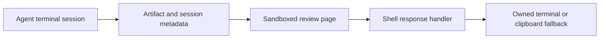

# Shelly: reviewing agent work through interactive pages

Shelly was my Rust/Tauri desktop experiment for working with coding agents. It combined terminal sessions with HTML review pages so a person could comment on a specific part of an agent's output and send a response back into the workflow.

Development has ended. The [historical source archive](https://github.com/mrgyatso/shelly-archive) and [recorded interactive browser demo](https://share.aletheia.dev/companion/) preserve the work. The demo runs without a live model or terminal session.

## The user loop

A long terminal answer makes it awkward to point to the exact paragraph, proposal or visual that needs a response. Shelly let an agent produce an interactive page with review controls. The desktop shell displayed the page and handled the resulting reply.

The terminal, page and session have different lifetimes. A terminal can exit while a page remains useful, and a user can reopen an old artifact after moving to another task. That makes identity and routing part of the interaction design.

## Three implementation boundaries

**Process ownership.** The shell owns pseudo-terminals and streams their output into the desktop UI. [`pty.rs`](https://github.com/mrgyatso/shelly-archive/blob/2230b9a037c83fa8ab3aeb5629a9b080e2f2af77/overlay/src-tauri/src/pty.rs) handles the process and output lifecycle; [`owned-terminals.ts`](https://github.com/mrgyatso/shelly-archive/blob/2230b9a037c83fa8ab3aeb5629a9b080e2f2af77/overlay/src/owned-terminals.ts) tracks terminal instances and their association with sessions and work units.

**Page rendering.** Generated HTML renders in an iframe with scripts enabled and same-origin access withheld. The [artifact loader](https://github.com/mrgyatso/shelly-archive/blob/2230b9a037c83fa8ab3aeb5629a9b080e2f2af77/overlay/src/artifact-view.ts) accounts for the interaction between Tauri's asset protocol, the frame sandbox and script execution. A page that displays successfully still needs working response controls.

**Reply delivery.** The [Board response handler](https://github.com/mrgyatso/shelly-archive/blob/2230b9a037c83fa8ab3aeb5629a9b080e2f2af77/overlay/src/board.ts#L5200) prefers the artifact's owned terminal, falls back to a terminal in the current work unit, and can use the clipboard when no owned terminal is available. It acknowledges delivery so the page can distinguish a completed send from failure. Those fallbacks are visible design tradeoffs; this snapshot does not establish perfect routing under every ambiguous state.

## A limitation worth understanding

An iframe sandbox does not prove that a posted submission came from a human click. The historical local-artifact response path assumes pages produced by the user's own agent and can submit into a terminal. That assumption would need a stronger trust and confirmation design before accepting arbitrary third-party pages. The archive is an interface and systems study, with that limitation retained in the source.

## Why it ended, and what is preserved

Maintaining a solo desktop integration around rapidly changing agent products became too costly, while similar interaction patterns became available in mainstream tools. I ended development and declared EOL on September 14, 2026.

The sanitized archive passed 14 JavaScript suites, its frontend production build, and 107 Rust library tests on that date. The earlier private baseline had 109 Rust tests; two tests left with the intentionally removed automatic plugin wiring. These checks cover the preserved source paths. A fresh native installer is not part of this archive's verified scope.

The recorded demo is the quickest way to inspect the interaction. The source shows the process, rendering and reply decisions behind it. No ongoing maintenance or support is planned.
